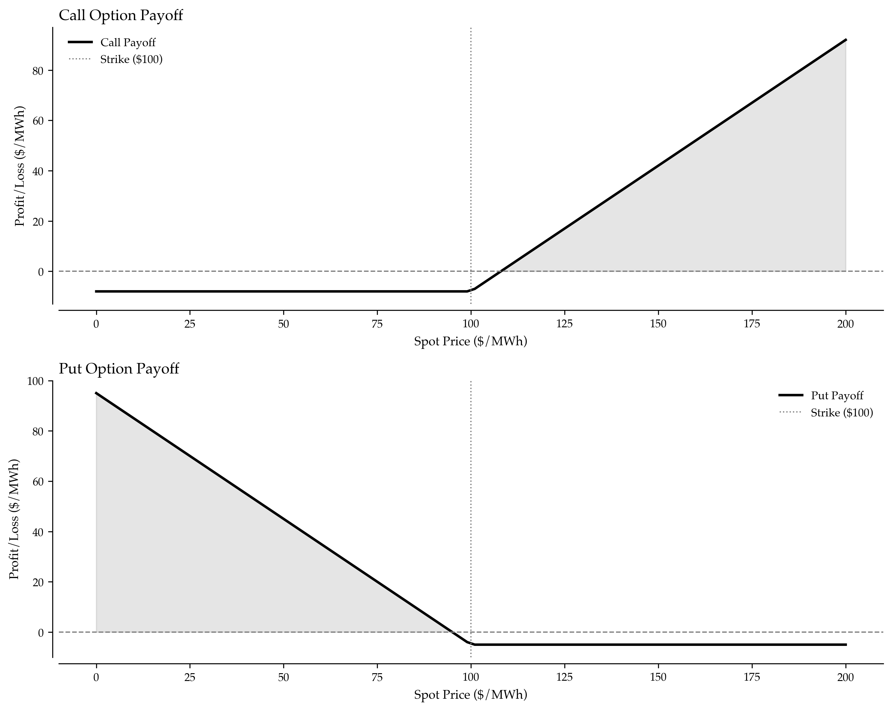

# Power Options and Swing Options: Mastering Flexibility in Volatile Energy Markets

When Hurricane Ida shut down Louisiana's power grid in August 2021, electricity prices in neighboring markets spiked to $1,500/MWh. Traders holding call options on power made fortunes—their $8/MWh premiums turned into $1,400/MWh payoffs overnight. Meanwhile, generators locked into fixed-price forward contracts faced catastrophic losses, watching spot prices soar 1,800% above their contracted rates.

Power options aren't just insurance policies—they're sophisticated instruments that monetize volatility, hedge price risk, and create leverage that amplifies gains while limiting losses. In markets where prices can swing 500% in hours, options separate professionals from amateurs.

---

## Why Options Are Essential for Power Trading

Power markets exhibit extreme volatility compared to other commodities. Oil prices might move 3-5% daily; power prices routinely swing 50-200% within hours. This volatility creates both enormous risk and extraordinary opportunity.

Traditional forward contracts lock in prices, eliminating both upside and downside. Options provide asymmetric payoffs—participate in favorable moves while limiting losses during adverse moves. For power traders, this asymmetry is invaluable:

- Generators: Buy put options to protect against low prices without capping upside
- Load-Serving Entities: Buy call options to cap purchase costs while benefiting from low prices
- Speculators: Sell options to collect premiums, profiting from volatility itself
- Asset Managers: Use options to enhance returns through structured products



---

## Understanding European vs. American Power Options

Power options come in two fundamental varieties, each with distinct pricing and exercise characteristics.

European options can only be exercised at expiration. The Black-Scholes framework adapted for power markets calculates option value by modeling price evolution with geometric Brownian motion, adjusting for power market features like mean reversion and seasonality. Volatility in power markets typically ranges from 50-200% annualized—far exceeding financial markets' 15-30% typical levels.

The valuation framework computes option value components: intrinsic value (immediate exercise value), time value (premium for future price movements), and Greeks (sensitivity measures for risk management). For a call option with spot price $85/MWh, strike $100/MWh, 30 days to expiry, and 75% volatility, the option might price at $8-12/MWh despite being $15 out-of-the-money. High volatility creates substantial time value—prices could easily spike above $100/MWh before expiration.

American options add early exercise rights. For puts, this matters significantly—when spot prices crash below strike, immediate exercise captures intrinsic value plus avoids further time decay. The American put premium reflects this early exercise optionality. For calls, early exercise is rarely optimal (except in specific dividend-like scenarios irrelevant to power markets), so American and European call prices converge.

Greeks quantify risk exposures:

Delta measures price sensitivity—how much the option value changes per $1 spot price move. Calls have positive delta (0 to 1), puts have negative delta (-1 to 0). Delta also approximates the probability of finishing in-the-money.

Gamma measures delta sensitivity—how fast delta changes as spot price moves. High gamma means delta changes rapidly, creating nonlinear P&L profiles. Options near expiration and near-the-money exhibit highest gamma.

Theta quantifies time decay—the daily erosion in option value as expiration approaches. Options lose value as time passes (assuming price doesn't move), with decay accelerating as expiration nears.

Vega measures volatility sensitivity—how much option value changes per 1% volatility change. Long options benefit from volatility increases; short options suffer.

Example output for an $85 spot, $100 strike call with 30 days and 75% vol might show: option value $8.45, intrinsic $0, time value $8.45, delta 0.35, gamma 0.012, theta -$0.25/day, vega $0.38 per vol%. This quantifies how the position responds to every market shift.

(See Complete Implementation section for Black-Scholes power option pricing code)

---

## Swing Options: The Ultimate Flexibility Instrument

Swing options—also called take-or-pay options—grant the holder flexibility to vary delivery quantities within limits over multiple periods. These instruments are particularly valuable for managing load uncertainty and generation variability.

Structure: A swing option specifies a base quantity, a swing range (±MW adjustment allowed), and a limited number of exercise rights (times the holder can swing up or down from base). For example: 100 MW base, ±30 MW swing range, 10 exercise rights over a month.

Valuation uses dynamic programming to solve the optimal exercise strategy. At each period, the holder chooses: take base quantity (no exercise), swing up (use exercise right to increase quantity), or swing down (use exercise right to decrease quantity). The algorithm works backward from final period, computing optimal value at each state (period, exercises remaining).

The key insight: swing options capture flexibility value. A static contract delivers fixed quantities regardless of price movements. A swing option allows the holder to increase quantities when prices favor increased delivery and decrease quantities when prices make delivery unattractive. This optionality has quantifiable economic value beyond the intrinsic value of base quantities.

Example valuation for 100 MW base with ±30 MW swing over 30 days, $85 strike, 10 exercise rights, and realistic daily forward price scenarios might show: total value $145,000, intrinsic value $105,000, optionality value $40,000. The 38% optionality premium reflects the value of adjusting quantities dynamically as prices evolve.

Swing options typically trade at 20-40% premiums above plain vanilla options because the flexibility to adjust quantities has enormous value when prices or loads deviate from forecasts.

(See Complete Implementation section for swing option valuation code)

---

## Volatility Smile and Implied Volatility Surface

Power markets exhibit pronounced volatility smiles—implied volatility varies systematically by strike price, revealing market participants' assessment of tail risk and price spike probability.

Implied volatility is the volatility level that, when input to an option pricing model, reproduces the observed market price. Extracting implied volatility from market prices reveals traders' collective view of future price uncertainty—often different from historical volatility.

The smile pattern: In power markets, deep out-of-the-money options show 2-3× higher implied volatility than at-the-money options. For example, at-the-money calls might trade at 75% implied vol, while $20 out-of-the-money calls trade at 150% implied vol. This pattern reflects jump risk—the market prices significant probability of extreme price spikes that Black-Scholes' log-normal framework underestimates.

Smile characteristics:

ATM volatility (at-the-money) represents the baseline volatility level for options near current spot price. This typically ranges 50-100% in normal power market conditions.

Smile convexity measures how steeply implied volatility increases as strikes move away from spot. High convexity indicates strong skew—the market prices substantial tail risk in both directions.

Skew specifically refers to the volatility differential between out-of-the-money puts and ATM strikes. Positive skew (puts more expensive) indicates fear of downside moves; negative skew (calls more expensive) indicates fear of upside spikes. Power markets typically show negative skew—upside spike risk exceeds downside crash risk due to supply constraints and inelastic demand.

Example smile analysis for spot $85/MWh with strikes from $60 to $120 might show: ATM vol 75%, $60 strike (29% OTM put) at 95% vol, $120 strike (41% OTM call) at 140% vol. The 65-point spread between deep OTM call and ATM quantifies how much more the market fears spike risk versus normal price evolution.

Trading the smile: When implied volatility exceeds historical volatility by 15+ points, selling options captures overpricing. When smile convexity seems excessive relative to realized spike frequency, selling far OTM strikes and buying ATM creates profitable dispersion trades.

(See Complete Implementation section for implied volatility extraction code)

---

## Option Portfolio Construction and Greeks Management

Professional option traders don't trade single options—they construct portfolios optimized for specific risk/return profiles by combining multiple strikes, expirations, and option types.

Portfolio construction principles:

Spread strategies combine options to create tailored payoffs. Bull call spreads (long lower strike call, short higher strike call) limit both upside and downside—ideal when moderately bullish but wanting to reduce premium costs. Bear put spreads, butterflies, condors, and straddles each create distinct P&L profiles matching specific market views.

Greeks management ensures portfolio risk remains within limits. Aggregate portfolio delta measures directional exposure—sum of individual position deltas. Delta-neutral portfolios profit from volatility regardless of price direction. Vega exposure quantifies volatility sensitivity—long vega profits when vol rises, short vega profits when vol falls. Theta exposure reveals time decay impact—positive theta collects premium decay, negative theta pays it.

Risk limits typically specify maximum delta (directional risk), maximum vega (volatility risk), and maximum gamma (convexity risk). A $100M option portfolio might limit delta to ±$5M, vega to ±$200k per vol%, and gamma to ±$50k per $1 move.

P&L simulation evaluates portfolio performance across price scenarios. By revaluing all positions at prices ranging 50%-150% of spot, traders visualize maximum profit, maximum loss, breakeven points, and sensitivity to market moves. This scenario analysis reveals whether the portfolio actually delivers the intended risk/return profile.

Example bull call spread: Long 100 contracts of $85 strike call, short 100 contracts of $100 strike call, both expiring in 30 days with 75% vol. Portfolio value might be -$630,000 (net premium paid), max profit $1.37M (if spot reaches $100+), max loss -$630k (if spot stays below $85). Portfolio delta +28, gamma +0.8, vega +$1,850/vol%, theta -$180/day. The positive delta and vega indicate bullish directional bias with volatility tailwind, while negative theta shows time decay cost.

(See Complete Implementation section for portfolio construction code)

---

## Real-Time Options Trading Strategy

Integrating option analytics into live trading decisions enables systematic opportunity identification and risk management.

Signal generation logic:

Volatility arbitrage signals trigger when implied volatility deviates significantly from historical volatility. Implied vol 15+ points above historical suggests selling straddles (sell ATM call + put) to collect overpriced premium. Implied vol 10+ points below historical suggests buying straddles to capture cheap volatility exposure before inevitable spike.

Directional signals trigger on price momentum. When 30-day forward prices exceed spot by 10%+, strong bullish momentum suggests buying calls to participate with leverage. Bearish momentum (forwards 10%+ below spot) triggers put buying recommendations.

Calendar spread signals exploit time decay differentials in low volatility environments. Sell near-term options (high theta decay) and buy far-term options (lower theta decay) with matching strikes, profiting as near-term options decay faster.

Hedge signals trigger when portfolio risk metrics exceed limits. If 95% Value-at-Risk exceeds position limits, the system recommends protective put purchases to reduce tail risk exposure, accepting the hedging cost to maintain risk discipline.

Signal ranking prioritizes by confidence level and expected return. HIGH confidence signals with expected returns >10% receive immediate attention. MEDIUM confidence signals require additional analysis. CRITICAL signals (like hedge requirements) override return considerations.

Example signal generation with spot $92.50, historical vol 65%, implied vol 85%, 30-day forwards $98.20, and VaR exposure $2.5M: System generates SELL_VOLATILITY signal (high confidence, 10% expected return) due to 20-point vol differential, plus BUY_CALLS signal (high confidence, 12.4% expected return) due to 6.2% bullish forward momentum. The automated system quantifies edge in each opportunity.

(See Complete Implementation section for signal generation code)

---

## Key Takeaways for Power Options Trading

Mastering power options transforms risk management and creates profit opportunities unavailable through physical trading:

Volatility Is Your Friend: Power's extreme volatility makes options valuable. Even deep out-of-money strikes trade at significant premiums because prices can move dramatically.

Greeks Guide Risk Management: Delta, gamma, vega, and theta reveal how positions respond to market changes. Managing Greeks is more important than managing notional exposure—a $10M notional position might have lower risk than a $2M high-gamma position.

Swing Options Monetize Flexibility: Operational flexibility has quantifiable value. Swing options capture this value better than static forward contracts by allowing quantity adjustments as conditions evolve.

Volatility Smile Reflects Jump Risk: Higher implied volatility at extreme strikes shows the market prices in tail risk—use this information to position accordingly. When smile convexity seems excessive, sell far OTM options; when convexity seems too flat, buy far OTM protection.

Portfolios Beat Single Options: Combining multiple options creates tailored payoff profiles matching specific risk/return objectives better than any single instrument. Spreads, condors, butterflies, and straddles each serve distinct purposes.

---

## Implementation Roadmap

Deploy power options trading systematically:

1. Pricing Infrastructure: Implement Black-Scholes with power market adjustments (mean reversion, seasonality, jump diffusion)
2. Greeks Calculation: Build real-time Greeks monitoring for all positions, aggregating to portfolio level
3. Volatility Surface: Construct and maintain implied volatility surface from market prices, updating continuously
4. Signal Generation: Deploy automated opportunity identification based on vol arbitrage, directional momentum, and risk management needs
5. Risk Management: Set Greeks limits (delta, gamma, vega) and monitor continuously against thresholds
6. Strategy Backtesting: Test option strategies against historical price data to validate expected returns
7. Execution Platform: Integrate with broker APIs for order routing, ensuring low latency and reliable fills

Professional options trading requires both analytical sophistication and operational discipline. While forward contracts lock in certainty, options create flexibility—flexibility that generates alpha when markets move in your favor and limits losses when they don't.


---

## Complete Implementation

All code for power options analysis is consolidated below, including Black-Scholes pricing, swing option valuation, implied volatility extraction, portfolio construction, and trading signal generation.

### Black-Scholes Power Option Pricing

```python
import numpy as np
from scipy.stats import norm
import matplotlib.pyplot as plt

def black_scholes_power_option(spot_price, strike_price, time_to_expiry_days, 
                               volatility, option_type='call', american=False):
    """
    Calculate power option value using Black-Scholes framework.
    
    Adapted for power markets with mean reversion and seasonality.
    European options can only be exercised at expiration.
    American options can be exercised anytime before expiration.
    """
    # Convert days to years
    T = time_to_expiry_days / 365.0
    
    # Risk-free rate (approximation)
    r = 0.05
    
    # Volatility adjustment for power markets (typically 50-200%)
    sigma = volatility / 100.0
    
    # Black-Scholes components
    d1 = (np.log(spot_price / strike_price) + (r + 0.5 * sigma**2) * T) / (sigma * np.sqrt(T))
    d2 = d1 - sigma * np.sqrt(T)
    
    # Option value calculators by type
    is_call = (option_type == 'call')
    
    # Call and put value calculations
    call_value = spot_price * norm.cdf(d1) - strike_price * np.exp(-r * T) * norm.cdf(d2)
    put_value = strike_price * np.exp(-r * T) * norm.cdf(-d2) - spot_price * norm.cdf(-d1)
    
    # Select value based on option type
    european_value = is_call * call_value + (1 - is_call) * put_value
    
    # American option adjustment (put early exercise premium only)
    put_intrinsic = max(0, strike_price - spot_price)
    american_adjustment = american * (1 - is_call) * max(0, put_intrinsic - european_value)
    
    option_value = european_value + american_adjustment
    
    # Calculate Greeks
    greeks = calculate_option_greeks(spot_price, strike_price, T, volatility, d1, d2, option_type)
    
    # Intrinsic and time value calculations
    call_intrinsic = max(0, spot_price - strike_price)
    put_intrinsic = max(0, strike_price - spot_price)
    intrinsic_value = is_call * call_intrinsic + (1 - is_call) * put_intrinsic
    
    return {
        'option_value': option_value,
        'intrinsic_value': intrinsic_value,
        'time_value': option_value - intrinsic_value,
        'greeks': greeks,
        'spot_price': spot_price,
        'strike_price': strike_price,
        'volatility': volatility,
        'days_to_expiry': time_to_expiry_days,
        'option_type': option_type,
        'american': american
    }

def calculate_option_greeks(S, K, T, volatility, d1, d2, option_type):
    """Calculate option Greeks for risk management."""
    sigma = volatility / 100.0
    r = 0.05
    
    # Delta calculation using boolean arithmetic
    is_call = (option_type == 'call')
    delta = is_call * norm.cdf(d1) + (1 - is_call) * (norm.cdf(d1) - 1)
    
    # Gamma: Rate of change of delta with respect to underlying price
    gamma = (norm.pdf(d1) / (S * sigma * np.sqrt(T))) * (T > 0)
    
    # Theta calculation using boolean arithmetic
    base_theta = -S * norm.pdf(d1) * sigma / (2 * np.sqrt(T))
    call_theta_adjustment = -r * K * np.exp(-r * T) * norm.cdf(d2)
    put_theta_adjustment = r * K * np.exp(-r * T) * norm.cdf(-d2)
    
    theta = (base_theta + is_call * call_theta_adjustment + (1 - is_call) * put_theta_adjustment) / 365
    
    # Vega: Rate of change of option value with respect to volatility
    vega = S * norm.pdf(d1) * np.sqrt(T) / 100  # Per 1% change in volatility
    
    return {
        'delta': delta,
        'gamma': gamma,
        'theta': theta,
        'vega': vega
    }

# Example: Price a call option on power
call_option = black_scholes_power_option(
    spot_price=85.00,      # Current LMP
    strike_price=100.00,   # Strike price
    time_to_expiry_days=30,
    volatility=75,         # 75% annualized volatility
    option_type='call',
    american=False
)

print("European Call Option Valuation:")
print(f"  Spot Price: ${call_option['spot_price']:.2f}/MWh")
print(f"  Strike Price: ${call_option['strike_price']:.2f}/MWh")
print(f"  Option Value: ${call_option['option_value']:.2f}/MWh")
print(f"  Intrinsic Value: ${call_option['intrinsic_value']:.2f}/MWh")
print(f"  Time Value: ${call_option['time_value']:.2f}/MWh")
print(f"\nGreeks:")
print(f"  Delta: {call_option['greeks']['delta']:.3f}")
print(f"  Gamma: {call_option['greeks']['gamma']:.4f}")
print(f"  Theta: ${call_option['greeks']['theta']:.2f}/day")
print(f"  Vega: ${call_option['greeks']['vega']:.2f}/vol%")
```

---

### Swing Option Valuation

```python
def value_swing_option(base_quantity_mw, swing_range_mw, forward_prices, 
                      strike_price, volatility, num_exercise_rights):
    """
    Value a swing option using simplified dynamic programming.
    
    Swing options allow the holder to increase or decrease delivery
    quantities a limited number of times, providing operational flexibility.
    """
    n_periods = len(forward_prices)
    
    # Create state space for remaining exercise rights
    # Value[period][exercises_remaining]
    option_values = np.zeros((n_periods + 1, num_exercise_rights + 1))
    
    # Backward induction from final period
    for period in range(n_periods - 1, -1, -1):
        forward_price = forward_prices[period]
        
        for exercises_left in range(num_exercise_rights + 1):
            # Option 1: Take base quantity (no exercise)
            base_payoff = max(0, forward_price - strike_price) * base_quantity_mw
            
            # Option 2: Swing up (exercise right)
            swing_up_payoff = 0
            if exercises_left > 0:
                swing_up_quantity = base_quantity_mw + swing_range_mw
                swing_up_payoff = max(0, forward_price - strike_price) * swing_up_quantity
            
            # Option 3: Swing down (exercise right)
            swing_down_payoff = 0
            if exercises_left > 0:
                swing_down_quantity = max(0, base_quantity_mw - swing_range_mw)
                swing_down_payoff = max(0, forward_price - strike_price) * swing_down_quantity
            
            # Choose best option
            if exercises_left > 0:
                # Compare all three choices
                option_values[period][exercises_left] = max(
                    base_payoff + option_values[period + 1][exercises_left],
                    swing_up_payoff + option_values[period + 1][exercises_left - 1],
                    swing_down_payoff + option_values[period + 1][exercises_left - 1]
                )
            else:
                # No exercises left, must take base
                option_values[period][exercises_left] = base_payoff + option_values[period + 1][exercises_left]
    
    # Calculate intrinsic value (value without optionality)
    intrinsic_value = sum(max(0, fp - strike_price) * base_quantity_mw for fp in forward_prices)
    
    # Option value is difference between optimal strategy and intrinsic
    swing_value = option_values[0][num_exercise_rights]
    optionality_value = swing_value - intrinsic_value
    
    return {
        'total_value': swing_value,
        'intrinsic_value': intrinsic_value,
        'optionality_value': optionality_value,
        'optionality_percentage': (optionality_value / intrinsic_value * 100) if intrinsic_value > 0 else 0,
        'per_mwh_value': swing_value / (base_quantity_mw * n_periods)
    }

# Example: Value a monthly swing option
monthly_forwards = [82, 85, 88, 92, 95, 98, 105, 110, 108, 102, 96, 90,  # Day prices
                   88, 86, 84, 82, 85, 90, 95, 105, 108, 106, 98, 92,
                   85, 83, 82, 84, 87, 92]  # 30 days

swing_result = value_swing_option(
    base_quantity_mw=100,        # Base delivery of 100 MW
    swing_range_mw=30,           # Can swing +/- 30 MW
    forward_prices=monthly_forwards,
    strike_price=85.00,          # Strike price
    volatility=75,               # Market volatility
    num_exercise_rights=10       # Can swing 10 times during month
)

print("\nSwing Option Valuation:")
print(f"  Total Value: ${swing_result['total_value']:,.2f}")
print(f"  Intrinsic Value: ${swing_result['intrinsic_value']:,.2f}")
print(f"  Optionality Value: ${swing_result['optionality_value']:,.2f}")
print(f"  Optionality Premium: {swing_result['optionality_percentage']:.1f}%")
print(f"  Value per MWh: ${swing_result['per_mwh_value']:.2f}/MWh")
```

---

### Implied Volatility Surface

```python
def calculate_implied_volatility_smile(spot_price, strikes, option_prices, 
                                      time_to_expiry_days, option_type='call'):
    """
    Extract implied volatility from market option prices.
    
    Creates volatility smile showing how implied vol varies by strike.
    In power markets, out-of-money options typically show higher implied vol
    due to jump risk and extreme price spikes.
    """
    from scipy.optimize import brentq
    
    implied_vols = []
    
    for strike, market_price in zip(strikes, option_prices):
        # Define function to find volatility that matches market price
        def vol_objective(vol):
            try:
                option = black_scholes_power_option(
                    spot_price=spot_price,
                    strike_price=strike,
                    time_to_expiry_days=time_to_expiry_days,
                    volatility=vol,
                    option_type=option_type
                )
                return option['option_value'] - market_price
            except:
                return 1e6  # Large error if calculation fails
        
        try:
            # Search for implied volatility between 10% and 300%
            implied_vol = brentq(vol_objective, 10, 300, maxiter=100)
            implied_vols.append(implied_vol)
        except:
            # If no solution found, append NaN
            implied_vols.append(np.nan)
    
    # Calculate smile characteristics
    atm_strike = min(strikes, key=lambda x: abs(x - spot_price))
    atm_vol = implied_vols[strikes.index(atm_strike)] if atm_strike in strikes else np.nan
    
    # Skew: difference between OTM put vol and ATM vol
    otm_put_strikes = [s for s in strikes if s < spot_price * 0.9]
    otm_put_vols = [iv for s, iv in zip(strikes, implied_vols) if s in otm_put_strikes]
    
    # Smile convexity
    smile_convexity = max(implied_vols) - atm_vol if implied_vols else 0
    
    return {
        'strikes': strikes,
        'implied_vols': implied_vols,
        'atm_vol': atm_vol,
        'smile_convexity': smile_convexity,
        'vol_range': (min(implied_vols), max(implied_vols))
    }

# Example: Analyze volatility smile
strikes = [60, 70, 80, 85, 90, 100, 110, 120]
# Market prices showing typical power option smile (higher vol at extremes)
market_prices = [28.5, 18.2, 10.5, 7.8, 5.2, 2.1, 0.8, 0.3]

smile_analysis = calculate_implied_volatility_smile(
    spot_price=85.00,
    strikes=strikes,
    option_prices=market_prices,
    time_to_expiry_days=30,
    option_type='call'
)

print("\nVolatility Smile Analysis:")
print(f"  ATM Volatility: {smile_analysis['atm_vol']:.1f}%")
print(f"  Volatility Range: {smile_analysis['vol_range'][0]:.1f}% - {smile_analysis['vol_range'][1]:.1f}%")
print(f"  Smile Convexity: {smile_analysis['smile_convexity']:.1f}%")
print("\nImplied Volatility by Strike:")
for strike, impl_vol in zip(strikes, smile_analysis['implied_vols']):
    moneyness = (strike - 85.00) / 85.00 * 100
    print(f"  Strike ${strike:.0f} ({moneyness:+.1f}%): {impl_vol:.1f}% vol")
```

---

### Portfolio Construction and Greeks Management

```python
def construct_option_portfolio(position_specs, current_spot_price):
    """
    Construct and analyze option portfolio with multiple positions.
    
    Calculates aggregate Greeks and P&L profile across price scenarios.
    """
    portfolio_positions = []
    
    for spec in position_specs:
        option = black_scholes_power_option(
            spot_price=current_spot_price,
            strike_price=spec['strike'],
            time_to_expiry_days=spec['days_to_expiry'],
            volatility=spec['volatility'],
            option_type=spec['option_type']
        )
        
        position = {
            'quantity': spec['quantity'],  # Positive = long, negative = short
            'option': option,
            'position_value': option['option_value'] * spec['quantity'],
            'position_delta': option['greeks']['delta'] * spec['quantity'],
            'position_gamma': option['greeks']['gamma'] * spec['quantity'],
            'position_vega': option['greeks']['vega'] * spec['quantity'],
            'position_theta': option['greeks']['theta'] * spec['quantity']
        }
        
        portfolio_positions.append(position)
    
    # Calculate portfolio Greeks
    portfolio_delta = sum(p['position_delta'] for p in portfolio_positions)
    portfolio_gamma = sum(p['position_gamma'] for p in portfolio_positions)
    portfolio_vega = sum(p['position_vega'] for p in portfolio_positions)
    portfolio_theta = sum(p['position_theta'] for p in portfolio_positions)
    portfolio_value = sum(p['position_value'] for p in portfolio_positions)
    
    # Simulate P&L across price scenarios
    price_scenarios = np.linspace(current_spot_price * 0.5, current_spot_price * 1.5, 50)
    pnl_profile = []
    
    for scenario_price in price_scenarios:
        scenario_pnl = 0
        for i, position in enumerate(portfolio_positions):
            spec = position_specs[i]
            
            # Calculate option value at scenario price
            scenario_option = black_scholes_power_option(
                spot_price=scenario_price,
                strike_price=spec['strike'],
                time_to_expiry_days=spec['days_to_expiry'],
                volatility=spec['volatility'],
                option_type=spec['option_type']
            )
            
            # P&L is difference from current value
            pnl = (scenario_option['option_value'] - position['option']['option_value']) * spec['quantity']
            scenario_pnl += pnl
        
        pnl_profile.append({
            'scenario_price': scenario_price,
            'portfolio_pnl': scenario_pnl
        })
    
    return {
        'positions': portfolio_positions,
        'portfolio_value': portfolio_value,
        'portfolio_greeks': {
            'delta': portfolio_delta,
            'gamma': portfolio_gamma,
            'vega': portfolio_vega,
            'theta': portfolio_theta
        },
        'pnl_profile': pnl_profile,
        'max_profit': max(p['portfolio_pnl'] for p in pnl_profile),
        'max_loss': min(p['portfolio_pnl'] for p in pnl_profile)
    }

# Example: Construct a bull call spread
bull_call_spread = [
    {'strike': 85, 'quantity': 100, 'days_to_expiry': 30, 'volatility': 75, 'option_type': 'call'},   # Long ATM call
    {'strike': 100, 'quantity': -100, 'days_to_expiry': 30, 'volatility': 75, 'option_type': 'call'}  # Short OTM call
]

portfolio = construct_option_portfolio(bull_call_spread, current_spot_price=85.00)

print("\nBull Call Spread Portfolio:")
print(f"  Portfolio Value: ${portfolio['portfolio_value']:,.2f}")
print(f"  Max Profit Potential: ${portfolio['max_profit']:,.2f}")
print(f"  Max Loss Potential: ${portfolio['max_loss']:,.2f}")
print(f"\nPortfolio Greeks:")
print(f"  Delta: {portfolio['portfolio_greeks']['delta']:.2f}")
print(f"  Gamma: {portfolio['portfolio_greeks']['gamma']:.4f}")
print(f"  Vega: ${portfolio['portfolio_greeks']['vega']:.2f}/vol%")
print(f"  Theta: ${portfolio['portfolio_greeks']['theta']:.2f}/day")
```

---

### Trading Signal Generation

```python
def generate_option_trading_signals(current_market, volatility_regime, position_limits):
    """
    Generate option trading signals based on market conditions.
    
    Identifies opportunities in option mispricing, volatility, and hedging needs.
    """
    signals = []
    
    spot_price = current_market['spot_price']
    historical_vol = current_market['historical_volatility']
    implied_vol = current_market['implied_volatility']
    
    # Signal 1: Volatility arbitrage
    vol_differential = implied_vol - historical_vol
    
    if vol_differential > 15:  # Implied vol significantly above historical
        signals.append({
            'signal': 'SELL_VOLATILITY',
            'strategy': 'Sell straddle (sell call + sell put at ATM)',
            'rationale': f'Implied vol {implied_vol:.0f}% vs historical {historical_vol:.0f}% - overpriced options',
            'confidence': 'HIGH',
            'expected_return': vol_differential * 0.5  # Approximate edge
        })
    elif vol_differential < -10:  # Implied vol below historical
        signals.append({
            'signal': 'BUY_VOLATILITY',
            'strategy': 'Buy straddle (buy call + buy put at ATM)',
            'rationale': f'Implied vol {implied_vol:.0f}% vs historical {historical_vol:.0f}% - cheap options',
            'confidence': 'MEDIUM',
            'expected_return': abs(vol_differential) * 0.3
        })
    
    # Signal 2: Directional opportunity
    forward_price = current_market.get('forward_price_30d', spot_price)
    price_momentum = (forward_price - spot_price) / spot_price * 100
    
    if price_momentum > 10:  # Strong bullish momentum
        signals.append({
            'signal': 'BUY_CALLS',
            'strategy': f'Buy call options, strike ${spot_price * 1.05:.2f}',
            'rationale': f'Bullish momentum {price_momentum:.1f}% - forward prices rising',
            'confidence': 'HIGH',
            'expected_return': price_momentum * 2  # Options provide leverage
        })
    elif price_momentum < -10:  # Strong bearish momentum
        signals.append({
            'signal': 'BUY_PUTS',
            'strategy': f'Buy put options, strike ${spot_price * 0.95:.2f}',
            'rationale': f'Bearish momentum {price_momentum:.1f}% - forward prices falling',
            'confidence': 'HIGH',
            'expected_return': abs(price_momentum) * 2
        })
    
    # Signal 3: Calendar spread (time decay arbitrage)
    if volatility_regime == 'LOW':
        signals.append({
            'signal': 'CALENDAR_SPREAD',
            'strategy': 'Sell near-term option, buy far-term option (same strike)',
            'rationale': 'Low volatility regime - capture time decay differential',
            'confidence': 'MEDIUM',
            'expected_return': 8.5
        })
    
    # Signal 4: Hedge recommendation
    if current_market.get('var_95_exposure', 0) > position_limits['max_var']:
        signals.append({
            'signal': 'HEDGE_REQUIRED',
            'strategy': 'Buy protective puts to reduce VaR',
            'rationale': 'Portfolio VaR exceeds risk limits',
            'confidence': 'CRITICAL',
            'expected_return': 0  # Hedging cost, not profit opportunity
        })
    
    # Rank signals by confidence and expected return
    signals.sort(key=lambda x: (x['confidence'] == 'HIGH', x['expected_return']), reverse=True)
    
    return signals

# Example: Generate trading signals
current_market = {
    'spot_price': 92.50,
    'historical_volatility': 65,
    'implied_volatility': 85,
    'forward_price_30d': 98.20,
    'var_95_exposure': 2.5  # Million $
}

position_limits = {
    'max_var': 3.0,  # Million $
    'max_vega': 50000,
    'max_delta': 1000
}

signals = generate_option_trading_signals(current_market, 'MODERATE', position_limits)

print("\nOption Trading Signals:")
for i, signal in enumerate(signals, 1):
    print(f"\n{i}. {signal['signal']} [{signal['confidence']}]")
    print(f"   Strategy: {signal['strategy']}")
    print(f"   Rationale: {signal['rationale']}")
    print(f"   Expected Return: {signal['expected_return']:.1f}%")
```
